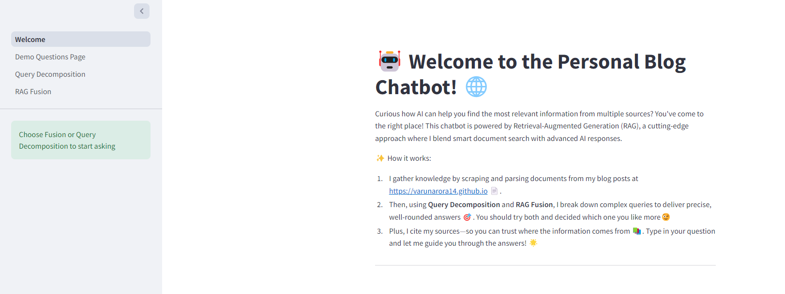
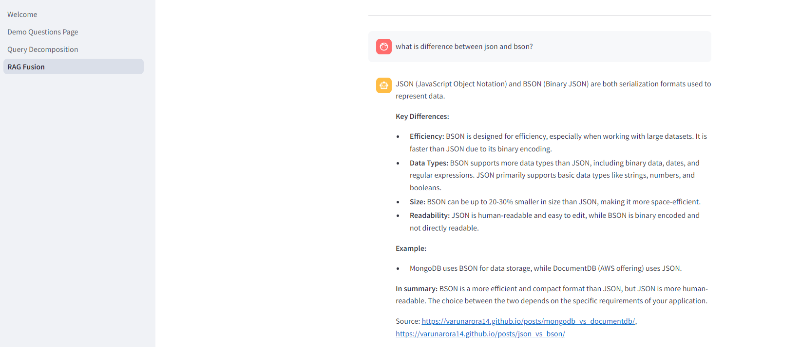
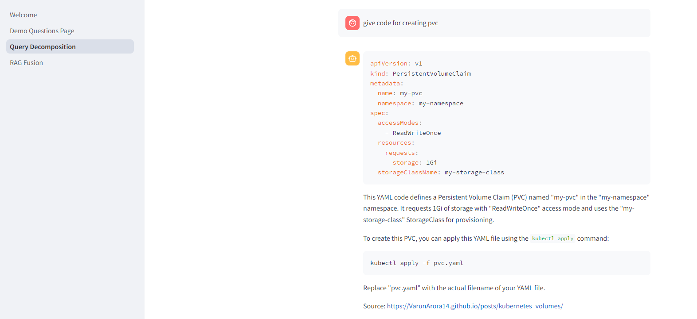

### Personal Blog Chatbot

This repo contains all the code that was used to build a chatbot over my blog post. The steps performed are -

- ### Scraping
  - Fetch all the urls of the blog using beautiful soup using file url_scraper.py
  - Filter urls so they may not contain duplicate and not contain outsider links as well (happens when blogs themselves have reference urls)
  - Store these urls in pkl file which will be used later to fetch data for RAG
- ### Blog Data to Vector Database
  - Blog urls were parsed via Langchain **AsyncHtmlLoader** and split into chunks
  - These chunked docs are loaded in vector database **FAISS** for retrieval
- ### RAG
  - Two techniques RAG fusion and Query Decomposition are implemented(as one is faster while other has better quality answers imo)
  - Data is parsed and converted in API format to be used
- ### Streamlit Frontend
  - Chat frontend is setup so users can enter queries and get LLM responses real time
  - caching is done for resources to avoid loading of vector database

To run the streamlit app, follow the following steps -

- `git clone repoUrl`
- `cd repoName`
- `python -m venv venv`
- Activate `venv`
- `pip install -r requirements.txt`
- Go to hugging face => your profile and get it's API token (for embedding creation)
- Go to google gemini and get Gemini free API key
- Create a `.env` file at root of folder and populate like below -

```
HUGGINGFACEHUB_API_TOKEN=hf_API_KEY
GOOGLE_API_KEY=gemini_API_KEY
```

This will help run APIs in `RAG` folder. For streamlit app APIs to run, create another folder named `.streamlit` and inside it file named `secrets.toml` and populate like following -

```
HUGGINGFACEHUB_API_TOKEN = "hf_API_KEY"
GOOGLE_API_KEY = "gemini_API_KEY"
```

This is so we can deploy it to streamlit cloud and use these as our secrets.

- Run command `streamlit run app/Welcome.py` to start the streamlit app

## Screenshots

### Home Page



### RAG Fusion - Q: What is difference between json and bson?



### Query Decomposition - Q: give code for creating pvc


